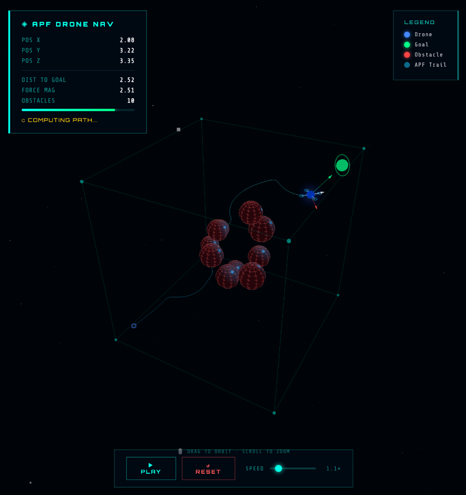

# APF Drone Simulation

A collection of real-time, interactive **3D simulations** of drones navigating through obstacles using the **Artificial Potential Field (APF)** algorithm — rendered entirely in the browser with [Three.js](https://threejs.org/).

  

<p align="center">
  
</p>

> No build steps, no dependencies to install. Open any `.html` file in a modern browser and run instantly.

---

## Simulations

### 1. `apf_drone_sim.html` — Single Drone, Static Obstacles
The original simulation. A single drone navigates from one corner of a 10×10×10 cube to the opposite corner, avoiding 10 static spherical obstacles using APF.

### 2. `apf_with_moving_obstacles.html` — Single Drone, Moving Obstacles
An enhanced version where **15 obstacles move continuously**, bouncing off the cube walls. The repulsive forces are significantly stronger (`K_REP = 40`) and the influence radius is wider (`D0 = 3.8`), making obstacle avoidance more dramatic. The drone reacts in real time to the changing environment.

### 3. `apf_drone_swarm.html` — 4-Drone Swarm, Moving Obstacles
The most advanced simulation. **4 drones** launch simultaneously from 4 different corners of the cube and all navigate toward the same goal corner. Key behaviors:
- **Fixed arrival order** — Alpha arrives first, followed by Beta, Gamma, and Delta, enforced by decreasing attractive gain (`K_ATT`) and max speed (`VMAX`) per drone.
- **Drone-drone collision avoidance** — Drones repel each other using an inter-drone APF repulsion term (`K_DRONE_REP = 28`), preventing mid-air collisions.
- **Goal capture zone** — Within 1.5 units of the goal, all repulsive forces are suspended so wall and drone-drone forces cannot trap a drone in a local minimum near the corner.
- **Disappear on arrival** — Each drone is removed from the scene as soon as it reaches the goal.
- **Per-drone HUD** — The status panel tracks each drone's state (Standby → Flying → #1–#4 Arrived) with arrival rank highlighted in gold, silver, bronze, and purple.

---

## The APF Algorithm

The **Artificial Potential Field** method is a reactive path planning approach. At each time step, virtual forces act on the drone and it moves in the direction of the net force — no pre-computed path needed.

```
F_total = F_attractive + F_repulsive_obstacles + F_repulsive_walls [+ F_repulsive_drones]
```

### Attractive Force
The goal pulls the drone toward it using a conic-parabolic hybrid:
- **Close range** (`d < D_STAR`): `F_att = K_ATT × (goal − position)`
- **Far range** (`d ≥ D_STAR`): `F_att = K_ATT × D_STAR × normalize(goal − position)`

### Repulsive Force (Obstacles & Walls)
Each obstacle pushes the drone away, but only within an influence radius `D0`:
```
F_rep = K_REP × (1/d − 1/D0) / d² × direction_away    [if d < D0]
```
Walls use the same formula with separate gain (`K_WALL`) and influence distance (`D_WALL`).

### Drone-Drone Repulsion (Swarm only)
In the swarm simulation, each drone also repels other drones using the same formula with `K_DRONE_REP` and `D_DRONE`, preventing collisions while still letting all drones converge on the same goal.

### Local Minima & Stuck Detection
If a drone's velocity drops below a threshold for 40+ consecutive frames, a random perturbation force is injected to escape the local minimum.

---

## APF Parameters

| Parameter | Moving Obstacles | Swarm | Description |
|---|---|---|---|
| `K_ATT` | 2.5 | 3.2 / 2.6 / 2.0 / 1.5 | Attractive gain (per drone in swarm) |
| `K_REP` | 40.0 | 40.0 | Obstacle repulsion gain |
| `D0` | 3.8 | 3.8 | Obstacle influence radius |
| `K_WALL` | 14.0 | 14.0 | Wall repulsion gain |
| `D_WALL` | 2.2 | 2.2 | Wall influence radius |
| `K_DRONE_REP` | — | 28.0 | Drone-drone repulsion gain |
| `D_DRONE` | — | 2.2 | Drone-drone influence radius |
| `VMAX` | 0.18 | 0.22 / 0.17 / 0.14 / 0.11 | Max speed (per drone in swarm) |

---

## Controls

| Input | Action |
|---|---|
| Left-click + drag | Orbit / rotate camera |
| Scroll wheel | Zoom in / out |
| Touch drag | Orbit (mobile) |
| Launch / Pause button | Start or pause the simulation |
| Reset button | Reset all drones to start positions |

---

## Getting Started

```bash
git clone https://github.com/Jitendra4Jalwaniya/apf_drone_simulation.git
cd apf_drone_simulation
open apf_drone_swarm.html   # or any of the other HTML files
```

> Requires any modern browser with WebGL support (Chrome, Firefox, Safari, Edge).

---

## Tech Stack

- **[Three.js](https://threejs.org/)** (r128) — 3D rendering via WebGL
- **Vanilla HTML / CSS / JavaScript** — no frameworks, no build tools
- **Google Fonts** — Share Tech Mono, Exo 2

---

## TODO

- [ ] Introduce a new version containing **harmonic potential fields** for smoother, curl-free navigation without local minima.
- [ ] Create bigger drone swarm (16-50-100 drones) with single target, all hitting it in random order.
- [ ] Turn the obstacles in interceptors.

---

## Acknowledgements

The idea originated from a conversation with **[Google Gemini](https://gemini.google.com)**, where the discussion on drone swarm algorithms introduced me to Artificial Potential Fields. You can read the [original conversation here](https://gemini.google.com/share/33bc55619bca).

The simulations were built with the help of **[Claude](https://claude.ai)**.

---

<p align="center"><sub>Built with APF and artificial potential fields</sub></p>
